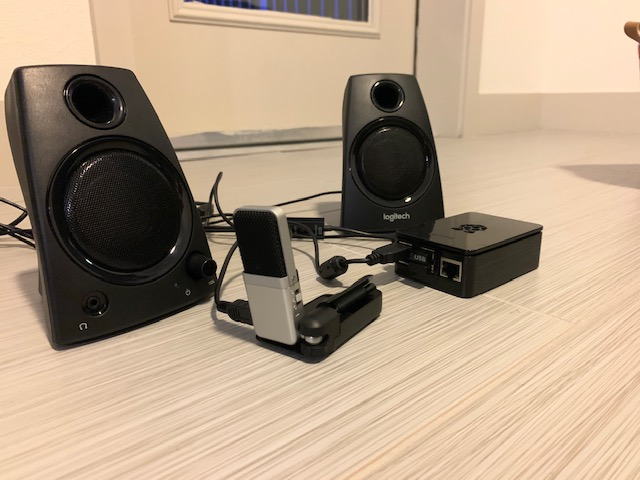
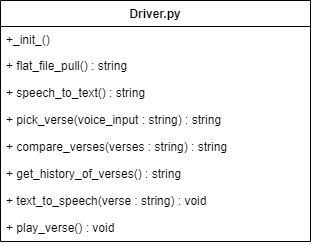
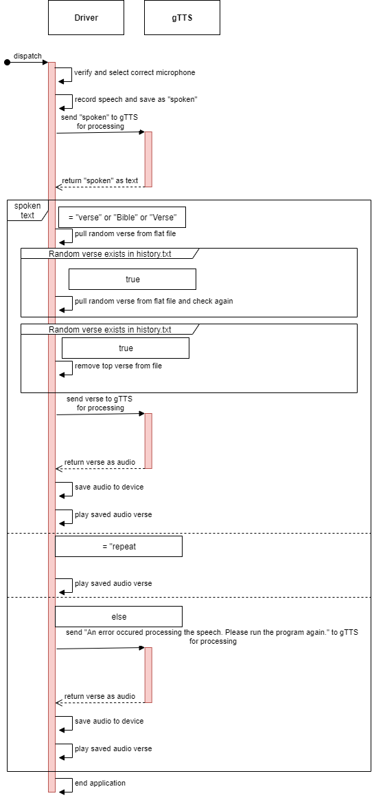
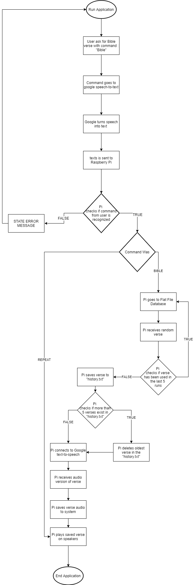
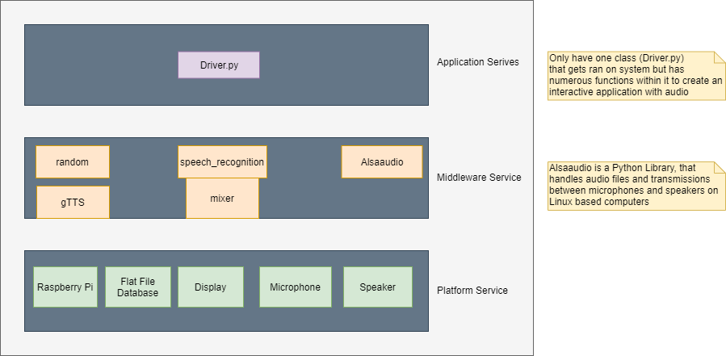
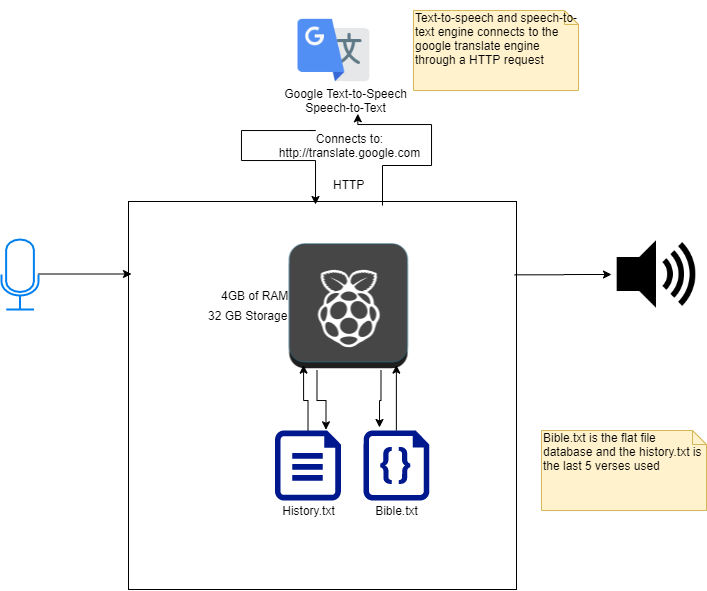

# Talk with God

## Introduction
The Bible Chatbot will help users feel closer to God by giving them a Bible verse of the day. The Bible verse will be saved in a text file and can be repeated until a new verse is requested. The used verses will be saved for 5 runs of the application. This will be using a device that is communicating with a Speaker and Microphone to give the user the Bible verse. This application will use Raspberry Pi, speaker, and microphone. This project can help people fill an empty void that they have from not being in God’s Word. 

## Requirements
### Non-Functional
1. User have the ability to command the chatbot to state a Bible Verse by saying "Bible"
2. User have the ability to command the chatbot to repeat the last used Bible Verse by saying "Repeat"
3. The application to be able to repeat the last used Bible Verse
4. The application to remove the oldest verse after running the application 5 times
5. Have the chatbot respond with a Bible Verse in an audio form
6. The verse to be stated back to user in the order of Book, Chapter, and Verse
### Functional
1. Chatbot respond to user with Bible Verse within 30 seconds
2. Chatbot respond to user with Error Message within 30 seconds
3. Chatbot saves used verse to "history.txt" within 30 seconds

## Technologies
Technologies that were used for this application was:
1. Python 3
2. Raspberry PI
3. Google Text-to-Speech
4. Google Speech-to-Text
5. Samson Microphone
6. Logitech Speakers
### Picture of main Hardware for the chatbot

## Diagrams

### UML Diagram
The UML Diagram lays out the function that are within the Driver.py class (the only class for this application). It clearly shows the name of the function and the return value of each function.

### Sequence Diagram
The Sequence Diagram shows the detailed flow of the application. With only having one class, the application goes does a self call throughout the entirety of the application, as well as calling out to gTTS which is Google Text-to-Speech.

### Flowchart Diagram
The flowchart shows the broad flow of the application. This clearly lays out the process of how the application works and the decisions that are made within the application.

### Logical Design Diagram
The Logical Design Diagram shows the logical relationships within the application. For this application, its clear to see how how each of the objects within relate.

### Physical Design Diagram
The Physical Design Diagram shows the most effective way of retrieving and storing the information from within the application. As many of the diagrams it shows the flow of how the data is being transmated. 

## Challenges within the Project
With this project there were a lot of risk and challenges that came up. At the beginning of the project, it was suppose to work using Amazon Lex and Polly to communicate with the user but because of time ristriction that became impossible to implement and have a working product by the deadline that was stated for this project. The ither big challenge within this project was getting the microphone and speaker to work together. At one point the microphone was working but the speakers were not, then the speakers were working and the microphone were working. To overcome this, there had to an update on the rapberry PI, update all of the libraries within application, and finally re-import all libraries one at a time.  
## Outstanding Issues
Outstanding issues within this project is that it does not constantly listen for a "wake up" word to run the application. To be able to run the application, the user must go into it manually and run it. 
## Future for the Application
In the future, the application will change from using Google Speech Engine to Amazon Lex and Amazon Polly to communicate from and to the user. From there it will also be able to be controlled from one's phone using the Amazon app or webpage. 

